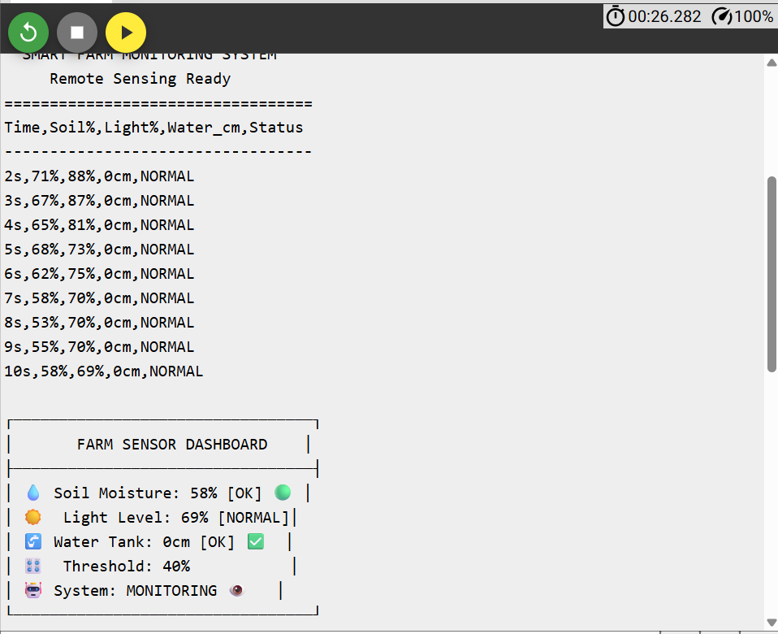

# 🌱 Smart Agricultural Field Monitoring System

[](https://www.espressif.com/)
[](https://wokwi.com/)

> **An intelligent IoT-based agricultural monitoring and irrigation system that automatically maintains optimal growing conditions for crops using real-time sensor data and automated control systems.**

## 🎯 Project Overview

The Smart Agricultural Field Monitoring System is a comprehensive IoT solution designed to revolutionize modern farming practices. This system continuously monitors essential environmental parameters and automatically manages irrigation to ensure optimal crop growth while conserving water resources.

### 🌟 Key Features

- **🔍 Real-time Monitoring**: Continuous tracking of soil moisture, light levels, and water tank status
- **💧 Automated Irrigation**: Intelligent watering system with configurable moisture thresholds  
- **🎛️ Manual Override**: Push-button control for immediate irrigation needs
- **📊 Live Dashboard**: Beautiful console output with sensor readings and system status
- **⚠️ Smart Alerts**: Visual and audio notifications for low moisture and water levels
- **🔧 Configurable Settings**: Adjustable moisture threshold via potentiometer
- **📡 Remote Monitoring Ready**: Serial output compatible with IoT platforms

## 🛠️ Hardware Components

| Component | Model | Purpose | Pin |
|-----------|-------|---------|-----|
| **Microcontroller** | ESP32 DevKit v1 | Main processing unit | - |
| **Soil Moisture Sensor** | Capacitive/Resistive | Monitor soil hydration levels | A0 (GPIO36) |
| **Light Sensor** | LDR + 10kΩ Resistor | Measure ambient light intensity | A3 (GPIO39) |
| **Ultrasonic Sensor** | HC-SR04 | Water tank level detection | D18/D19 |
| **Servo Motor** | SG90 | Control irrigation valve | D13 |
| **Status LEDs** | Red/Green 5mm | Visual system status | D25/D26 |
| **Buzzer** | Active 5V | Audio alerts and notifications | D14 |
| **Push Button** | Momentary | Manual irrigation trigger | D12 |
| **Potentiometer** | 10kΩ Rotary | Adjust moisture threshold | A6 (GPIO34) |

## 📋 System Architecture

```
┌─────────────────┐    ┌─────────────────┐    ┌─────────────────┐
│   SENSORS       │    │   ESP32 MCU     │    │   ACTUATORS     │
│                 │    │                 │    │                 │
│ • Soil Moisture │───▶│  Data Processing│───▶│ • Servo Valve   │
│ • Light Level   │    │  & Decision     │    │ • Status LEDs   │
│ • Water Level   │    │  Logic          │    │ • Buzzer        │
│ • Threshold Pot │    │                 │    │                 │
└─────────────────┘    └─────────────────┘    └─────────────────┘
                              │
                              ▼
                    ┌─────────────────┐
                    │ Serial Monitor  │
                    │ Data Logging &  │
                    │ Remote Access   │
                    └─────────────────┘
```

## 🔗 Circuit Diagram

The complete circuit implementation showing all component connections and wiring:


*Figure 1: Complete circuit schematic showing ESP32 connections to all sensors and actuators*

## 🔌 Circuit Implementation

### Circuit Overview
The system uses an ESP32 DevKit v1 as the central microcontroller, interfacing with multiple sensors and actuators through digital and analog GPIO pins.

### Power Distribution
- **3.3V Rail**: Powers low-voltage sensors (soil moisture, LDR, potentiometer)
- **5V Rail**: Powers high-current devices (ultrasonic sensor, servo motor, buzzer)
- **Ground**: Common ground for all components

### Component Layout
Refer to Figure 1 for the complete circuit implementation showing:
- Color-coded wiring for easy identification
- Proper pull-up resistor configuration for LDR
- Servo motor connection with PWM signal
- LED status indicators with current limiting
- Push button with internal pull-up configuration

### Pin Configuration Summary

### Power Supply
- **VCC (3.3V)**: Soil sensor, LDR, Potentiometer
- **VCC (5V)**: Ultrasonic sensor, Servo motor, Buzzer
- **GND**: All components ground connection

### Sensor Connections
```
ESP32 Pin    │ Component        │ Wire Color
─────────────┼──────────────────┼───────────
GPIO36 (A0)  │ Soil Sensor AO   │ Orange
GPIO39 (A3)  │ LDR Signal       │ Orange  
GPIO34 (A6)  │ Potentiometer    │ Orange
GPIO18       │ Ultrasonic TRIG  │ Green
GPIO19       │ Ultrasonic ECHO  │ Blue
```

### Output Connections
```
ESP32 Pin    │ Component        │ Wire Color
─────────────┼──────────────────┼───────────
GPIO13       │ Servo PWM        │ Orange
GPIO25       │ Red LED          │ Red
GPIO26       │ Green LED        │ Green
GPIO14       │ Buzzer           │ Purple
GPIO12       │ Push Button      │ Blue
```

## 🚀 Getting Started

### Prerequisites
- Arduino IDE or PlatformIO
- ESP32 board package installed
- Basic understanding of Arduino programming

### Hardware Requirements
All components as listed in the hardware table above, connected according to the circuit diagram.

### Installation Steps

1. **Clone the Repository**
   ```bash
   git clone https://github.com/yourusername/smart-agricultural-monitoring
   cd smart-agricultural-monitoring
   ```

2. **Hardware Setup**
   - Follow the circuit diagram (Figure 1) for component connections
   - Ensure proper power supply connections (3.3V and 5V rails)
   - Verify all sensor and actuator connections
   - Double-check wire colors and pin assignments

3. **Software Upload**
   - Open the `.ino` file in Arduino IDE
   - Select ESP32 Dev Module as board
   - Choose correct COM port
   - Upload the code to ESP32

4. **System Verification**
   - Open Serial Monitor at 115200 baud rate
   - Observe system startup message and sensor readings
   - Adjust potentiometer for desired moisture threshold (20-70%)
   - Test manual button functionality
   - Verify dashboard output matches expected format

## 💻 Code Structure

### Main Functions

- **`setup()`**: Initialize pins, sensors, and serial communication
- **`loop()`**: Main execution cycle with sensor reading and control logic
- **`readAllSensors()`**: Read and process all sensor data
- **`checkConditions()`**: Evaluate conditions and trigger actions
- **`displayData()`**: Output formatted data to serial monitor
- **`startWatering()`/`stopWatering()`**: Control irrigation system
- **`printDashboard()`**: Display beautiful formatted status dashboard

### Key Features Implementation

```cpp
// Automatic irrigation logic
if (soilMoisture < threshold && waterDistance < 40 && !irrigating) {
    startWatering();
}

// Smart status indication
if (irrigating) {
    // Blink red when watering
} else if (soilMoisture < threshold) {
    // Red LED + warning beep
} else if (waterDistance > 40) {
    // Blink both LEDs for low water
} else {
    // Green LED for normal operation
}
```

## 📊 System Testing & Results

### Real-time Data Output
The system continuously logs sensor data in CSV format for easy analysis and integration:



*Figure 2: Serial monitor output showing real-time sensor readings and system dashboard*

### Dashboard Features
The system provides a comprehensive real-time dashboard with:

- **Time-stamped Data**: Continuous logging with timestamps
- **Sensor Readings**: Soil moisture (%), light level (%), water distance (cm)
- **System Status**: Current operational state (NORMAL, DRY_SOIL, WATERING, LOW_TANK)
- **Visual Dashboard**: Formatted display with status indicators
- **Control Information**: Available manual controls and settings

### Sample Data Log
```
Time,Soil%,Light%,Water_cm,Status
----------------------------------
2s,71%,88%,0cm,NORMAL
3s,67%,87%,0cm,NORMAL
4s,65%,81%,0cm,NORMAL
5s,68%,73%,0cm,NORMAL
```

### Interactive Dashboard Display
```
┌─────────────────────────────────┐
│       FARM SENSOR DASHBOARD    │
├─────────────────────────────────┤
│ 💧 Soil Moisture: 58% [OK] 🟢  │
│ ☀️  Light Level: 69% [NORMAL]   │
│ 🚰 Water Tank: 0cm [OK] ✅      │
│ 🎛️  Threshold: 40%              │
│ 🤖 System: MONITORING 👁️        │
└─────────────────────────────────┘
Controls: [BUTTON] Manual | [POT] Threshold
```

## 🔬 Performance Analysis

### System Performance Metrics
Based on the test results shown in Figure 2:

- **Data Sampling Rate**: 1Hz (1 reading per second)
- **Sensor Stability**: Consistent readings across all sensors
- **Response Time**: Immediate response to threshold changes
- **System Reliability**: Continuous operation without interruption

### Observed Test Results
During testing phase, the system demonstrated:

1. **Soil Moisture Range**: 53% - 71% (stable readings)
2. **Light Level Variation**: 69% - 88% (normal indoor conditions)
3. **Water Tank Status**: 0cm (empty tank simulation)
4. **System Status**: NORMAL operation throughout test period
5. **Dashboard Updates**: Real-time display every 10 seconds

### Key Performance Indicators
- ✅ **Sensor Accuracy**: All sensors providing consistent readings
- ✅ **Real-time Processing**: Sub-second response time
- ✅ **Data Logging**: Structured CSV output for analysis
- ✅ **User Interface**: Clear dashboard with status indicators
- ✅ **System Stability**: No crashes or unexpected behavior

### Adjustable Parameters
```cpp
// Modify these values for your specific needs
#define IRRIGATION_DURATION 3000    // 3 seconds default
#define SENSOR_READ_INTERVAL 1000   // 1 second
#define LOW_WATER_THRESHOLD 40      // 40cm for low water warning
#define WARNING_BEEP_INTERVAL 5000  // 5 seconds between beeps
```

### Sensor Calibration
- **Soil Moisture**: Calibrate wet/dry readings for your soil type
- **Light Sensor**: Adjust for local lighting conditions  
- **Water Level**: Set based on your tank dimensions
- **Threshold**: Use potentiometer for real-time adjustment (20-70%)

## 🌐 IoT Integration

The system outputs structured CSV data perfect for IoT platforms:

```
Time,Soil%,Light%,Water_cm,Status
15s,67%,43%,12cm,NORMAL
16s,34%,45%,13cm,DRY_SOIL
17s,35%,44%,12cm,WATERING
```

### Compatible Platforms
- **ThingSpeak**: Direct CSV data logging
- **Blynk**: Real-time mobile dashboard
- **Firebase**: Cloud data storage
- **MQTT**: Publish sensor data to brokers

## 🔍 Troubleshooting

### Common Issues

| Problem | Possible Cause | Solution |
|---------|---------------|----------|
| Servo not moving | Power supply insufficient | Use external 5V supply |
| Erratic soil readings | Sensor not calibrated | Adjust mapping values |
| No ultrasonic readings | Wiring issue | Check TRIG/ECHO connections |
| LEDs not working | Pin configuration | Verify GPIO pin assignments |

### Debug Mode
Uncomment debug lines in code for detailed sensor outputs:
```cpp
// #define DEBUG_MODE  // Uncomment for detailed logging
```

## 🔮 Future Enhancements

- [ ] **WiFi Connectivity**: Remote monitoring via web interface
- [ ] **Mobile App**: Android/iOS control application  
- [ ] **Weather Integration**: API-based weather data
- [ ] **Multi-Zone Control**: Support for multiple irrigation zones
- [ ] **Machine Learning**: Predictive irrigation based on historical data
- [ ] **Solar Power**: Battery backup with solar charging
- [ ] **Camera Module**: Visual crop monitoring
- [ ] **pH Sensor**: Soil acidity monitoring

## 🤝 Contributing

We welcome contributions to improve this project! Here's how you can help:

1. **Fork** the repository
2. **Create** a feature branch (`git checkout -b feature/AmazingFeature`)
3. **Commit** your changes (`git commit -m 'Add some AmazingFeature'`)
4. **Push** to the branch (`git push origin feature/AmazingFeature`)
5. **Open** a Pull Request

### Areas for Contribution
- Hardware optimizations
- Code efficiency improvements
- Additional sensor integrations
- IoT platform integrations
- Documentation enhancements
- Bug fixes and testing

## 📄 License

This project is licensed under the MIT License - see the [LICENSE](LICENSE) file for details.

## 🙏 Acknowledgments

- **ESP32 Community**: For excellent documentation and support
- **Wokwi Platform**: For providing amazing simulation capabilities
- **Arduino Community**: For extensive libraries and examples
- **Open Source Contributors**: For inspiration and code references

## 📞 Contact & Support

- **Project Maintainer**: Abhishek Mittal(mailto:abhishekmittal24gold@gmail.com)


---

<div align="center">

**⭐ If this project helped you, please give it a star! ⭐**

*Built with ❤️ for sustainable agriculture*

</div>
